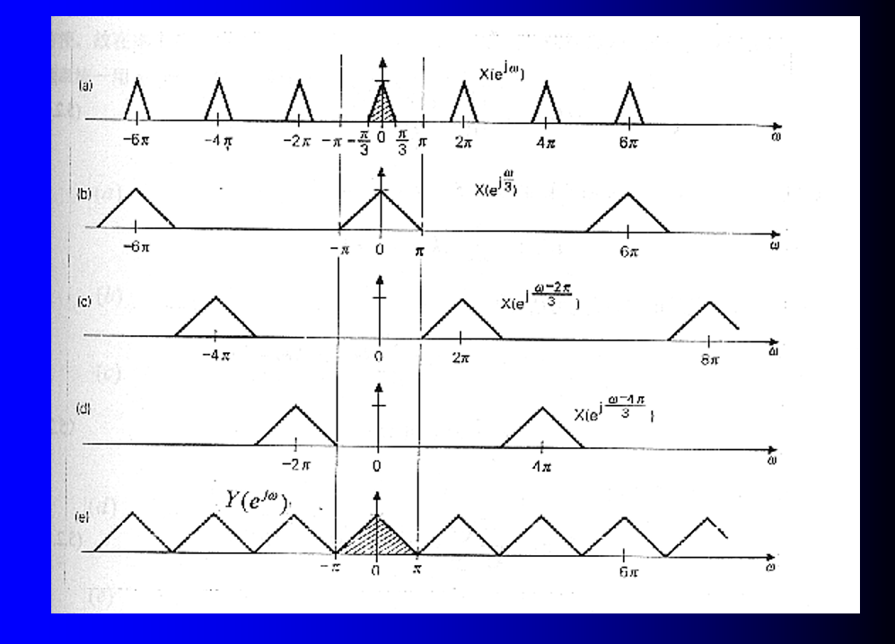
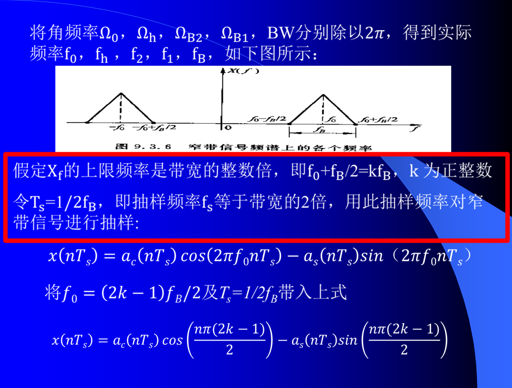

---
vlook-query:ws=none&cf=off
---

###### 高等数字信号处理复习攻略 <u>yuXiaoee</u>~(Og)~ 2023/12

[TOC]

# 傅里叶变换

傅里叶变换的习题比较少，这里给出一道之前的考题。

## 习题

# DFT

## 图形解释

## 习题

### 分辨率

习题如下：

### 定义

对本题的另一种解释

# FFT

FFT里面重要的，就是CZT。

## CZT（线性调频Z变换）

`#1能够根据题目意思，求出来θ和φ0|🗨#`~(Ye!)~

感觉这里老师写的有些问题，下面给出了一个参考的解题思路：

`#2能够分析历年的题目|🗨#`~(Ye!)~

**看书上定义P184-187**

下面给出了一个参考的解题思路：

 

# 信号的抽取和插值

## 采样率转换

#### 例1 分析采样率转换

#### 例2 分析抽样的过程

#### 例3 分析采样率转换

## 滤波器组

## 窄带信号抽样定理

# Hilbert变换

## 单边带信号

注意：要会求下边带。

## 希尔伯特变换对

## 实因果信号与Hilbert变换

会求下面这个题

# WALSH变换

## 预备知识

### 雷德麦彻函数

### 阿达玛（Hadamard）矩阵 

### **模二加减法运算**

### 格雷(Gray)码

例题

## 离散沃尔什函数 

## 矩阵形式

三种方法

## 考题

### 三种方法

### 22年考题

### 20年考题

# 功率谱

证明题。

# END
